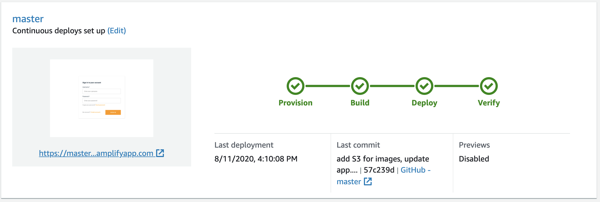

# React Note app 

  

This note app it was created by following AWS tutorial.  I got my hands wet using Amplify lavereging my existing front-end skillset to add cloud functionality into  application such as auth, data, analytics, push notifications, and more.

# Give it a try! [Here](https://feature-qa.dy5llcbnmbl47.amplifyapp.com/)

    - Create an account
    - Login
    - Add a note and image
    - Delete an account by click on delete button

### What I learn: 
      - AWS Amplify
      - Amazon Cognito for authentication
      - GraphQL API that leverages AWS AppSync
      - Amazon DynamoDB
 
 I have deployed a web application using AWS Amplify! I have added authentication to note app allowing users to sign up, sign in, and manage their account. The note app also has a scalable GraphQL API configured with an Amazon DynamoDB database allowing users to create and delete notes. I have also added file storage using Amazon S3 allowing users to upload images and view them in their app.

#### This learning tutorial just touch the surface of each technoligy; there is way more to learn but I found this demo well documented and easy to understand, if you would like to give it a try, go for it! 

[Build a react app with AWS amplify](https://aws.amazon.com/getting-started/hands-on/build-react-app-amplify-graphql/)

